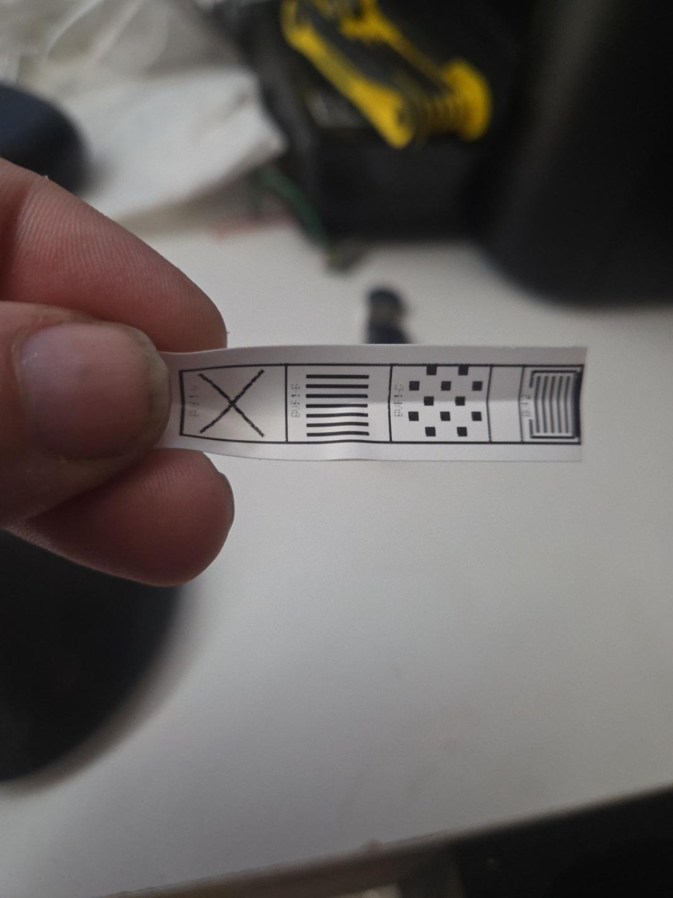

# SUPVAN E10 Linux

**Unofficial Linux driver + continuous-label editor for the SUPVAN E10 thermal label printer.**


This project exists because the E10 works well from SUPVAN's mobile app, but historically had no comfortable Linux workflow. It packages the printer transport/service and a small desktop label editor into one community project.

> **Tested hardware:** SUPVAN E10 (`T0010...`) on Linux Mint, Bluetooth Classic/RFCOMM.
>
> This project is independent and is not affiliated with or endorsed by SUPVAN.

## What is included

### E10 Linux driver/service

The Rust driver integrates the E10 with CUPS/IPP and handles the unpleasant parts so applications do not need to know the printer protocol:

- Bluetooth discovery and persisted paired-device recovery
- E10/T15 print protocol
- multi-buffer compressed print transfers
- CUPS job lifecycle and cancellation
- per-printer job serialization
- live media interrogation before E10 jobs
- recovery after printer-app restarts
- recovery after Bluetooth disconnects
- physical power-loss recovery
- narrow self-healing for stale BlueZ links after `EHOSTDOWN`

### SUPVAN Label Studio

A GTK desktop editor aimed at the E10's continuous tape:

- tape runs left to right on screen
- custom label length
- optional **Auto-size Length** with end margin
- text objects
- imported images
- boxes and lines
- move, duplicate, rotate and delete objects
- exact-raster PNG export
- direct CUPS printing
- **full printable-width QR-code generation** from arbitrary text/URLs
- QR modules are kept aligned to whole printer dots instead of being casually resampled

The E10's physical print head is 96 dots (12 mm at 8 dots/mm). The vendor-style usable content band qualified by this project is 88 dots (11 mm), centered on that head.

## Quick install

For the current public candidate, clone the repository and run:

```bash
./install.sh
```

The installer builds/installs the printer service and installs Label Studio for the current user.

Then pair the E10 in your normal Linux Bluetooth UI, power it on, and launch:

```bash
supvan-label-studio
```

Label Studio detects available CUPS queues. Create a label and press **PRINT**.

## Continuous tape

The E10 should be treated as a narrow continuous-roll printer, not as a printer that fundamentally only understands 30/40/50 mm pages. Width is constrained by the head and stock; print length is generated from the raster height and split into as many T15 buffers as required.

The editor therefore works in **millimetres** and supports fixed or content-driven lengths. Very long output is structurally supported, but the project deliberately does not claim every possible multi-metre length has been physically qualified yet.

## QR codes

Click **Generate QR Code**, enter text, a URL, a serial number, or any other payload, and Label Studio creates a movable QR object sized to the full 88-dot printable band by default.

The renderer preserves integer printer-dot modules. If a payload is too dense to produce a sensible physical code at this narrow width, the app warns instead of silently generating mush.

## Hardware qualification

The E10 implementation was tested on real hardware through progressively nastier release gates:

1. **Protocol / multi-buffer output**: exact 88×400 raster, two T15 buffers, complete far-end physical output.
2. **CUPS lifecycle / back-to-back jobs**: serialized jobs, live media use, no unsafe geometry fallback, clean retirement.
3. **Service outage / cancellation / reconnect**: queued jobs survive service downtime, canceled jobs do not print, reconnect succeeds.
4. **Physical power loss / cold start**: printer may disappear while the service runs or the service may start while the printer is off. Held jobs recover after power-on without requiring a service restart. A stale BlueZ `Connected=yes`/`EHOSTDOWN` state is cleared and RFCOMM retried once.

A physical acceptance print from the qualification work:



## Why T15 matters

Reverse engineering of SUPVAN's Android application showed that the E10/T0010 route uses the vendor's **T15** printing implementation, not the T50Plus path. That distinction is the core reason generic T50-style attempts could connect yet fail to print correctly.

Known E10/T15 properties used here include:

- 8 dots/mm (~203 dpi)
- 96-dot physical head
- 12 bytes per print column
- 4000-byte raw print buffer
- 14-byte T15 buffer header
- up to 332 print columns per raw buffer
- independent compression per buffer
- `START_PRINT` → `PAPER_BACK` → compressed buffers → `BUF_FULL(0)` → natural completion
- no `STOP_PRINT` on successful completion

See [`docs/PROTOCOL.md`](docs/PROTOCOL.md) for the engineering notes included with the driver.

## Status and known limitations

This is an early community release. The core E10 print path is real-hardware qualified, but there is still polish to do:

- density/darkness control needs broader physical calibration
- very long multi-metre jobs need soak testing before we advertise a hard maximum
- additional tape widths/materials need more physical qualification
- E10 BLE printing is not claimed as production-qualified; Bluetooth Classic/RFCOMM is the proven path
- packaging will improve beyond the current installer

Please report failures with the printer model/name, Linux distribution, relevant CUPS state, and service logs. Do **not** post private Bluetooth identifiers unless they are necessary for debugging.

## Development

Driver checks:

```bash
cd driver
cargo fmt --check
cargo test --workspace
cargo check --workspace
```

Label Studio tests:

```bash
cd label-studio
python3 -m unittest discover -s tests -v
```

## Project layout

```text
.
├── driver/          Rust protocol, printer service, CUPS/IPP integration
├── label-studio/    Python/GTK label editor
├── docs/            protocol, install, qualification and screenshots
├── install.sh       combined user-facing installer
└── uninstall.sh     removal helper
```

## Attribution and licensing

This work grew from the open-source `supvan-cups` project and includes substantial E10-specific reverse engineering, protocol work, resilience fixes, continuous-roll handling, and Label Studio. See [`ATTRIBUTION.md`](ATTRIBUTION.md) and the license files in this repository for exact notices and terms.

If you redistribute or modify the project, preserve the upstream notices and applicable licenses.

## Contributing

Issues, logs, protocol observations, hardware testing and patches are welcome. See [`CONTRIBUTING.md`](CONTRIBUTING.md).

If you own a different SUPVAN model and want to help qualify it, please make it very clear which model and serial-name family you tested. We do not want one printer's protocol assumptions quietly leaking into another model again.
