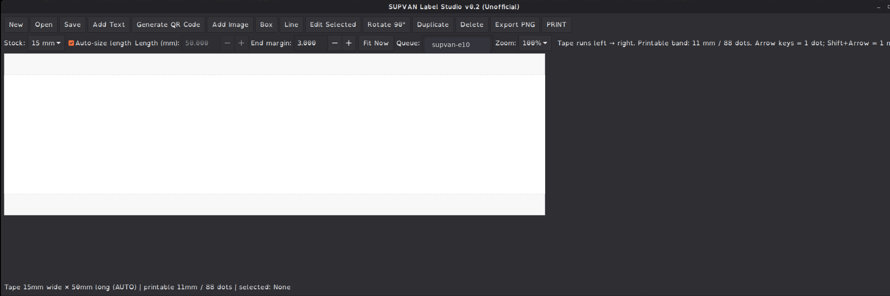
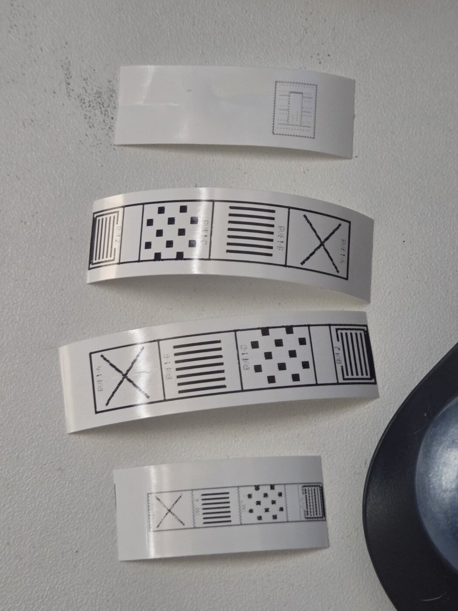

# SUPVAN E10 Linux Suite

**Unofficial Linux driver + continuous-label editor for the SUPVAN E10.**

This repository packages two pieces that belong together:

1. **`driver/`** — a Rust IPP/CUPS printer service with physically qualified
   E10/T15 Bluetooth support.
2. **`label-studio/`** — a GTK label editor with continuous-length tape,
   auto-sizing, text/images, and full-width movable QR codes.

> **Status:** public-candidate / early release. The E10 path has been exercised
> extensively on Linux Mint with real hardware, including power loss, CUPS job
> retention, cancellation, reconnects and multi-buffer output. Other SUPVAN
> models retained from the upstream driver have **not** been re-qualified by
> this fork.

## Label Studio

<p align="center">
  
</p>

The companion GTK editor treats the E10 as continuous tape rather than a stack of fixed pages. Design left-to-right, auto-size the length, add text or images, generate full-width movable QR codes, then send the exact 88-dot raster through the qualified CUPS driver.

## Proof that the tiny beast prints

<p align="center">
  
</p>

<p align="center">
  
</p>

Label Studio renders the exact device raster before CUPS submission:

<p align="center">
  
</p>

## What works

### E10 driver

- SUPVAN E10 / Bluetooth name family `T0010...`.
- Bluetooth Classic RFCOMM printing.
- E10-specific **T15** protocol, not the T50 print path.
- 96-dot physical thermal head with an 88-dot / 11 mm printable content band.
- 8 dots/mm feed geometry (about 203 dpi).
- Multi-buffer compressed output for labels longer than one T15 buffer.
- CUPS/IPP job submission and queue lifecycle.
- Held-job recovery after printer/application outages.
- BlueZ stale-link self-healing after physical power loss.
- Cold-start recovery when the service starts while the printer is off.
- Exact 88-pixel-wide JPEG mode for continuous Label Studio jobs.

### Label Studio

- Tape runs **left to right** on screen.
- **Auto-size Length** or manual length.
- Full-width **Generate QR Code** button. Enter text/URL/data and it creates a
  movable scan-safe QR object.
- Movable text, images, rectangles and lines.
- Rotate, duplicate, edit and delete objects.
- Arrow keys move one printer dot (0.125 mm); Shift+Arrow moves 1 mm.
- 12 mm / 15 mm stock visualization.
- Exact-raster PNG export.
- Automatic CUPS queue detection, with a manual queue field if needed.
- Editor length range: **5 mm to 6000 mm**.

## Continuous tape, not fixed 50 mm pages

The E10 is best treated as a fixed-width roll printer:

- stock width: typically 15 mm;
- physical head: 12 mm / 96 dots;
- verified printable content band: 11 mm / 88 dots;
- feed resolution: 8 dots/mm;
- label length: chosen by the job.

A 50 mm label is therefore 88 × 400 printable dots. A 100 mm label is
88 × 800. Label Studio can represent much longer strips, although very long
multi-metre jobs are not yet part of the public hardware qualification claim.

## Quick start on Linux Mint / Ubuntu

### 1. Pair the E10

Use Linux Mint's Bluetooth settings and pair/trust the printer first. Its name
normally begins with `T0010`.

### 2. Install the suite

```bash
git clone https://github.com/robingosse/supvan-e10-linux.git
cd supvan-e10-linux
./install.sh
```

The installer checks the required Rust, CUPS, BlueZ, GTK and Python pieces,
then installs the printer service and Label Studio into your user account.

If dependencies are missing, it prints the exact Linux Mint / Ubuntu `apt`
command to install them. See [docs/INSTALL.md](docs/INSTALL.md) for the manual
path.

### 3. Launch Label Studio

Open **SUPVAN E10 Label Studio** from the Mint application menu, or run:

```bash
supvan-label-studio
```

Create something, click **Generate QR Code** if desired, then **PRINT**.

## Repository layout

```text
.
├── driver/          Rust IPP/CUPS + Bluetooth/T15 printer stack
├── label-studio/    Python/GTK continuous label editor
├── docs/            installation, troubleshooting, qualification and protocol notes
├── install.sh       installs both components for the current user
└── uninstall.sh     removes both user-scoped components
```

## Qualification summary

The E10 implementation was subjected to four hardware qualification gates
before packaging:

- **Gate 1:** correct T15 protocol and real two-buffer printing.
- **Gate 2:** complete-job serialization, live-media safety, back-to-back jobs,
  CUPS retirement and final hardware idle.
- **Gate 3:** service outage retention, queued cancellation and Bluetooth
  reconnect.
- **Gate 4:** physical printer power loss, real BlueZ `EHOSTDOWN` stale-link
  repair, and cold-start recovery while the printer begins powered off.

See [docs/QUALIFICATION.md](docs/QUALIFICATION.md).

## Known limitations

- **Only the E10 is physically release-qualified by this fork.** The inherited
  upstream model registry contains other SUPVAN models, but this project does
  not claim new hardware validation for them.
- E10 release testing is based on Bluetooth Classic RFCOMM. BLE printing is not
  part of the E10 qualification claim.
- The editor permits very long continuous jobs, but multi-metre output has not
  yet been physically endurance-tested.
- Thermal darkness/density deserves a dedicated visual calibration pass before
  a later stable release.
- First public packaging is source/user-install oriented. A polished combined
  `.deb` is planned.

## Troubleshooting

Start with [docs/TROUBLESHOOTING.md](docs/TROUBLESHOOTING.md).

Useful commands:

```bash
systemctl --user status supvan-printer-app
journalctl --user -u supvan-printer-app --no-pager -n 100
lpstat -p -d
```

## Development

Driver:

```bash
cd driver
cargo test --workspace
cargo check --all-targets
```

Label Studio:

```bash
cd label-studio
PYTHONPATH=. python3 -m pytest -q
```

Run everything available on the current machine:

```bash
make test
```

## License and credits

MIT. See [LICENSE](LICENSE) and [ATTRIBUTION.md](ATTRIBUTION.md).

This is an independent community project. **SUPVAN is a trademark of its
respective owner; this project is not affiliated with or endorsed by SUPVAN.**
